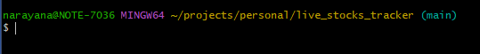
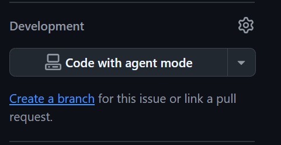
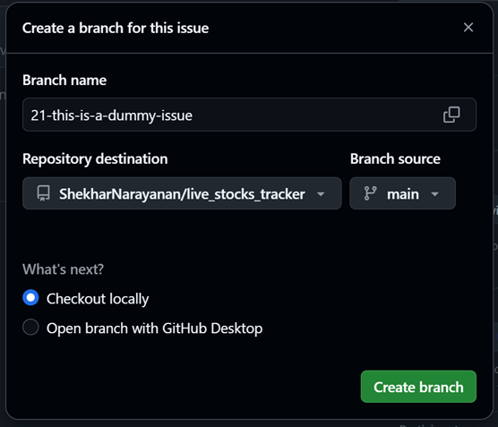
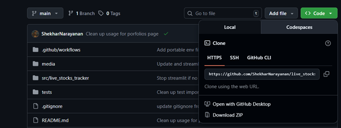

# GIT COMMANDS AND THEIR USAGE

Overview: Git is a version control software - meaning that it can track all versions of your code seamlessly. It is also absolutely essential when it comes to collaborating with colleagues on your code.

Notes: Every copypastable code line is highlighted in green like this. Any urls or links that can be clicked on are highlighted in blue like [this](https://www.google.com/).

*Git is a version control software that helps you keep track of all changes in your code. If you wish to learn through a nice online tutorial, please go* [*here*](https://www.youtube.com/watch?v=RGOj5yH7evk&t=360s)*. Here are some of the most used commands when starting out (not in any particular order):*

1. git clone <url>: this command lets you create a copy of an online repository on Github onto your computer.
2. git switch branch\_name : makes sure you are at the right branch. The name of the branch is written in blue text in your git terminal. In the image below, it is �main�. You can replace �branch\_name� with your branch.

1. git pull: this command lets you get the current version of all your files available online on the repository onto your computer. It will also modify your files based on their versions online. **Note, this is different from git fetch, which gets you all the files remotely in your PC but *does not* automatically modify your files.**
2. git status: this tells you how many files have been changed since their last version and what are the names of those files. **Note, a command called git log gives you your entire commit message history from the beginning to the end.**
3. git add <name of file>: this command enables you to add the most recent version of a specific file. You can write the first three or four letters of your file name and press �Tab� to make git autocomplete the file name.
4. git commit -m �my commit message�: this is the command that helps you attach a message to your changes. Replace the message within the double quotes to something that tells other people what changes you made. For example: �Add function to improve efficiency�
5. git push: this command will make your changes available online.
6. git branch <branch\_name> : A **branch** in Git is like a **separate copy of your project** where you can make changes **without affecting the main version**. This makes a new branch for you. The usage of this command will be explained later on.

# USING ISSUES ON GITHUB AS A TODO LIST

1. **Github has a feature called �issues�. Whenever you wish to change significant portions of your code/ or work on a specific �TODO� on your code, the first step is to create an issue on Github. You will find them in the main tab on the screen as shown below.**

# **Once you click on issues, you can click on new issue as shown in the top right of the image below**

#

# Give a title and description for the issue. Optionally, you can assign them to yourself/someone else if you wish

1. **When you are done creating the issue, scroll down on the page and find the �Development� section somewhere on the right. Click on �Create a branch� as highlighted in blue.**

****

1. **When you perform step 4, the following opens and you can click on �Create branch� on the bottom left. This is the branch that you will be working with for your TODO.**

****

#

# STEPS TO FOLLOW

When you don�t have the repository linked to your computer yet ***(start with these if you do not know how to proceed with git or github yet):***

1. Create a repository if you haven�t already. Use [these](https://docs.github.com/en/repositories/creating-and-managing-repositories/creating-a-new-repository) steps. If you already have one, proceed to step 2.
2. Install git for windows from [here](https://git-scm.com/downloads/win)
3. Open the github of your repository.
4. Press the button that is green and says �Code�.

1. Make sure you are looking at the HTTPS link. Keep this tab open, we will need to use it.
2. In your PC, decide a place where you wish to download the repository. Make sure you remember this location and its easily accessible.
3. Right click and click on Open git bash here
4. Write *git clone <url>*. Replace <url> by the HTTPS link you will copy from the window in step 4. You will need to right click to paste the link. Press Enter when you are done.
5. If everything works well, you will now have a folder in your PC with the exact name as the one you.
6. Next, in the command line, write the following code: cd name\_of\_your\_folder(cd is short for *change directory,* and by doing this we are simply going to the correct folder on our PC). Replace the text after cd with the actual name of your folder.
7. Next, you will create a new branch for yourself. This is done so collaboration is made easier on GitHub
8. Write git branch your\_branch\_name (replace the text after branch with text that makes it easy for you to remember its your branch - like firstname\_edits)
9. Now we will make the branch available online.
10. Write git push --set-upstream origin branch\_name. Replace the **branch\_name** with your own.

**When you have already cloned the repository (the github repository is on your PC linked with git)**

The usual order of doing things is as follows:

1. Open Git Bash using the right click of your mouse inside the folder that you are making changes. This is done in your file explorer (how you usually access folders inside your Windows PC)
2. Write *git switch <name of your branch>*: make sure you are working in the right branch.
3. Write *git pull* : before we make any changes to our files, we want to make sure that we are working with the most updated version of the files.
4. Make changes to your file(s) and make sure to save them on your computer first. This is typically done using �ctrl + s�. In version control, it is recommended to not change lots of unrelated things at once inside a single file. This is because you will have to give a summary message to those changes (shown in point 8). Try to change specific bits of code at once in a single file.
5. Now in the git terminal, write *git status*: this will inform you about all the files that have changed.
6. Use **git diff**. This command finds out *exactly* what was changed in each file. For instance, if you write �git diff my\_file.m�, git diff will show you where code was added or deleted.***Note that this is absolutely essential when working with an AI tool as they will regularly change things in your code without informing you. Using this tool can help you reject some changes before you choose to put them online.***
7. Use *git add file\_name* : From the files that are changed (you will see those files in step 5), you can now choose to add them to version control by writing something like git add my\_file.m. I recommend adding one file at a time using git add. But for more clarification, please refer to the foot note about this point.
8. Use *git commit -m �message�*: attach a message that summarizes your changes. It is recommended to change singular or similar things/concepts in your files so a single commit message can very briefly describe what you did. For example, if you want to add a function for gradient descent and another one for hyper parameter tuning, consider adding only one of those changes first, committing them and then proceeding to the next one.
9. Use git push \*\*: this will make your changes available online. You do not need to push every time you commit something, but I recommend pushing everything online at least once a day.

**Foot notes:**

7: It is also okay to combine multiple files when adding and committing them. For instance, if I am building an application and I change code in two files for a similar reason, I can combine them in one git add line (git add file1.m file2.m) -> and then commit them like (git commit -m �Add functionality x in file1 and file2�). I still recommend adding every file and committing individually for now.

8: if you are pushing to a branch for the first time, you will need to write *git push --set-upstream origin <branch\_name>* . Here, your branch name is shown by git in blue text right next to your path. After performing this step, the next time you want to make your changes available online ou only need to write **git push** (after adding and committing your changes)
